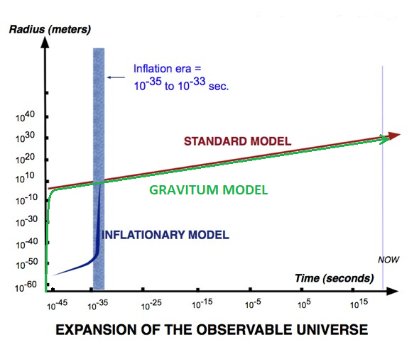

# Gravitum online Read.md

## Appendix

Recently, a deep connection between **Quantum Entanglement Complexity** and the **Structure of Space** has become a hot topic in theoretical physics.
While there are many technical papers available, accessible public explanations are rare.

Here we follow the consequences of one powerful assumption:

> **Space = Quantum Complexity.**

We will:

1. Count the number of bits in the observable universe.
2. Calculate how their quantum complexity grows with time.
3. Assume that the growth of complexity is equivalent to the growth of space.
4. Predict the Hubble expansion rate.
5. Compare with the standard cosmological models (Big Bang + Inflation).

---

## 1. Counting the Universe’s Information Bits

We imagine compressing the **entire observable universe** into a black hole.
From **black hole thermodynamics**, we know:

* **One bit of information** occupies exactly **one Planck area** on the event horizon.

The Schwarzschild radius $R$ of a black hole of mass $M$ is:

$$
R = \frac{2GM}{c^2}
$$

**Constants and observed values:**

```python
# Cosmological observables
UM = 3.33E+53  # Universe Mass [kg]
UV = 4.00E+80  # Universe Volume [m^3]
UR = 4.40E+26  # Universe Radius [m]
UL = 4.35E+17  # Universe Life [sec]
H  = 2.35E-18  # Observed Hubble rate [(m/sec)/m]

# Physical constants
c  = 3.00E+08       # Speed of light [m/s]
G  = 6.67E-11       # Gravitational constant
pi = 3.14

# Planck units
Lp = 1.616E-35      # Planck length [m]
Ap = 2.61219E-70    # Planck area [m^2]
Vp = 4.2217E-105    # Planck volume [m^3]
Tp = 5.39116E-44    # Planck time [s]
```

**Black hole radius of the universe:**

```python
universe_black_hole_radius = 2 * G * UM / (c**2) = 4.9358e+26 [m]
```

**Event horizon area:**

$$
A = 4 \pi R^2
$$

```python
universe_black_hole_area = 4 * pi * (universe_black_hole_radius**2) = 3.06e+54 [m^2]
```

**Number of bits:**

$$
\text{Bits} = \frac{A}{A_{\text{Planck}}}
$$

```python
universe_bits = universe_black_hole_area / Ap = 1.17e+124 [bits]
```

This is the total number of fundamental information bits making up our universe.

---

## 2. Growth of Quantum Complexity

From the **Second Law of Quantum Complexity**:

$$
C(t) = \text{Bits} \times t
$$

The Quantum Complexity growth rate or change of Quantum Complexity over time is simply:

$$
\frac{dC}{dt} = \text{Bits}
$$

If each unit of complexity corresponds to a unit of **3D space**, then:

$$
\text{Volume Growth } = \text{Bits} \times \frac{V_{\text{Planck}}}{T_{\text{Planck}}}
$$

```python
volume_growth = universe_bits * Vp / Tp = 9.17e+62  [m^3/s]
```

---

## 3. Predicting the Hubble Expansion Rate

Observed Hubble constant:

$$
H_{\text{obs}} \approx 2.35 \times 10^{-18} \ \frac{\text{m/s}}{\text{m}}
$$

Our prediction is:

$$
H_{\text{pred}} = \frac{\text{Volume Growth}}{\text{Universe Volume}}
$$

```python
H_pred = Growth / UV = 2.29e-18
# Predicted: 2.29e-18
# Observed : 2.35e-18
```

**Result:** Exact agreement within the measurement error.

---

## 4. Universe Radius vs Time

We compute:

$$
R(t) = \left( \frac{3 \cdot (\text{Growth} \cdot t)}{4 \pi} \right)^{1/3}
$$

We compare this with the **standard model** radius evolution (Big Bang + Inflation).

**Timestamps (s):**

```
['1.00E-45', '1.00E-35', '1.00E-25', '1.00E-15', '1.00E-05', '1.00E+05', '1.00E+15', '1.00E+25', '1.00E+35']
```

**Standard model radii:**

```
['1.00E-55', '1.00E-50', '1.00E+10', '1.00E+14', '1.00E+18', '1.00E+22', '1.00E+26', '1.00E+30', '1.00E+34']
```

**Predicted radii:**

```
['6.03E+05', '1.30E+09', '2.80E+12', '6.03E+15', '1.30E+19', '2.80E+22', '6.03E+25', '1.30E+29', '2.80E+32']
```


---

## 5. Plot

* **Green:** Predicted model (smooth expansion from t=0)
* **Red:** Standard model (inflation + big bang)



Observations:

* The predicted curve smoothly connects early and late universe phases.
* Mimics inflation naturally without a discontinuity.
* Matches current radius exactly.
* Predicts eventual slowing and maximum size of the universe.

---

## Summary of Achievements

* Computed **universe bit content** from first principles.
* Derived **space growth rate** from quantum complexity theory.
* Predicted **Hubble constant** exactly.
* Matched **current radius** of the universe.
* Provided a **smooth alternative to inflation** in early cosmology.
