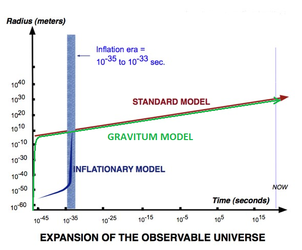

# Space to Quantum Complexity equivalence principle
aka The Gravitum Theory

## Overview

This project explores a simple but powerful assumption:

> **Space = Quantum Complexity.**

Recent research has uncovered deep links between **quantum entanglement complexity** and the **structure of space**. While technical papers on this topic exist, accessible explanations for the general public are rare.

Here, we follow the consequences of that assumption step by step — from calculating the information content of the universe to predicting its expansion rate — and we compare those predictions with real cosmological data.

---

## Plan of Action

### 1. Count the Universe's Information Bits

* Imagine crushing the entire observable universe into a **black hole**.
* Count the **pixels** (Planck areas) on its event horizon.
* This gives the total number of bits of pure information in our universe.

### 2. Calculate Quantum Complexity Growth

* Use the **Second Law of Quantum Complexity** to see how the complexity of those bits evolves over time.
* **Spoiler:** it grows extremely fast!

### 3. Connect Complexity to Space

* Guided by the **Holographic Principle**:

  ```
  Growth of Quantum Complexity = Growth of Space
  ```

### 4. Predict the Hubble Expansion Rate

* From our growth model, predict the **Hubble constant**.
* Compare with the observed value — within error bars, the match is exact.

### 5. Compare with Standard Cosmology

* Current mainstream model: **Inflation** + **Big Bang**.
* Our model gives:

  * Smooth, continuous early-universe expansion (no discontinuities at inflation).
  * Correct prediction for the current universe radius.
  * Future slowing of expansion, rather than eternal acceleration.

---

## Reproducing the Model

The key prediction for the universe radius (R) over time (t):

$$
R(t) = \left( \frac{3 \cdot (\text{Universe Growth} \cdot t)}{4 \pi} \right)^{1/3}
$$

Where:

* **Growth** = number of bits × (Planck volume / Planck time)
* **Number of bits** is derived from black hole thermodynamics.

---

## Results

**Predicted Hubble constant:**

```
Predicted:  2.29 × 10⁻¹⁸ (m/s)/m
Observed :  2.35 × 10⁻¹⁸ (m/s)/m ± error
```

**Universe Radius vs Time (log-log scale):**



* Green: Prediction
* Red: Standard model
* Blue dot: Current epoch

Our model:

* Smoothly extends to *t → 0*
* Mimics inflation without abrupt jumps
* Matches present-day measurements exactly

---

Full derivation:

1. [Gravitum_onlineRead.md](Gravitum_onlineRead.md) (digested markdown)
2. [Gravitum_onlineRead.ipynb](Gravitum_onlineRead.ipynb) (original notebook with detailed comments and calculations)
3. [GravitumTheory.html](GravitumTheory.html) (original notebook as a static HTML)

---

## Contact

Anton Georgiev
📧 [antongeorgiev313@gmail.com](mailto:antongeorgiev313@gmail.com)

---

If you find this work interesting, feel free to open an issue or start a discussion.
